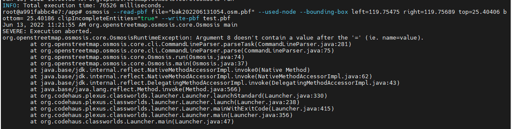
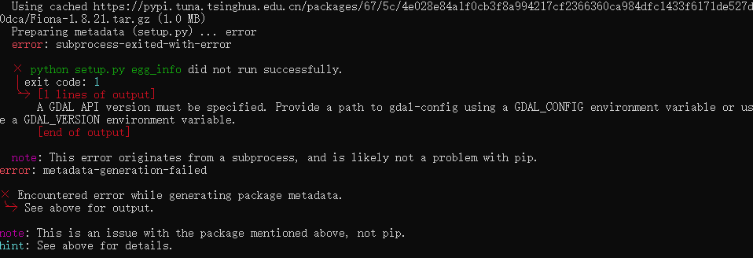

#1.数据裁剪出错

裁剪  
osmosis --read-pbf file="bak202206131054.osm.pbf" --used-node --bounding-box left=119.75475 right=119.75689 top=25.40406 bottom=
25.40186 clipIncompleteEntities="true" --write-pbf test.pbf 

#2.环境配置错误
python -m pip install -r requirements.txt -i https://pypi.tuna.tsinghua.edu.cn/simple
**`numpy>=1.15.2
scipy>=1.1.0
lxml>=4.2.5
commonroad-io>=2018.1
pandas~=1.3.0`**
pyproj==2.6.0
utm~=0.7.0
xmlschema~=1.6.4
Shapely~=1.7.1
minio~=7.1.0
geographiclib~=1.52
PyQt5~=5.15.4
matplotlib~=3.4.2
geopandas~=0.9.0

#3.不同的代表什么意思（运行案例）

simParseClient.py 在线仿真解析脚本  
apolloParseClient.py apollo解析脚本     
cheluClient.py 车路协同解析脚本     

nohup /bin/python3 /home/user/Tgis/dev/testSimParseClient.py > myout.log 2>&1 &