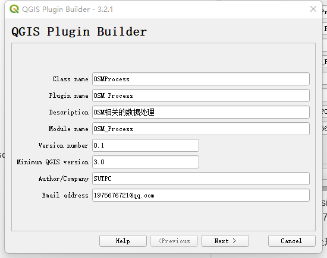
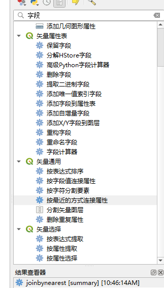
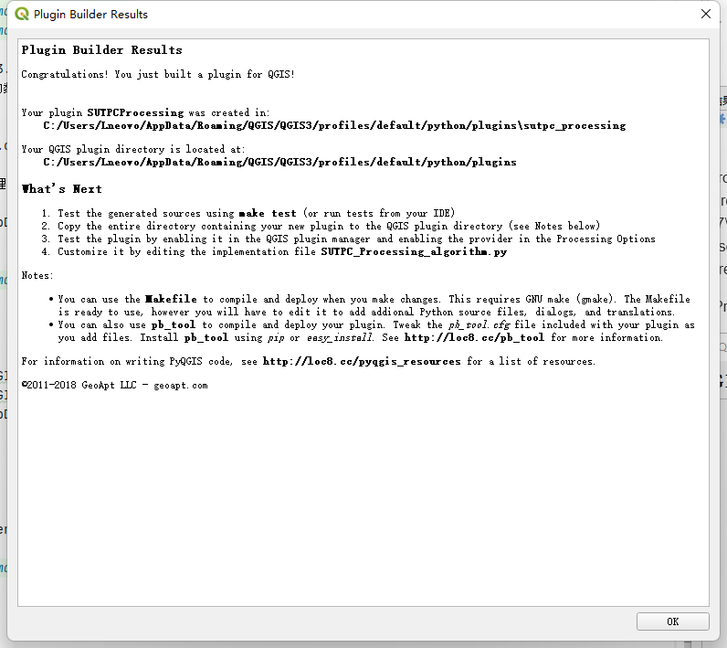

##创建qgis plugin

name=SUTPC Plugins
qgisMinimumVersion=3.0
description=OSM相关的数据处理流程
version=0.1
author=SUTPC
email=1975676721@qq.com

about=OSM相关的数据处理流程

"C:\Users\Lneovo\AppData\Local\Programs\Python\Python37\Scripts\pyrcc5.exe" -o resources.py resources.qrc

##把属性连接到最近的线
  
脚本：LinkID.py

"C:\Program Files\QGIS 3.22.7\apps\Python39\Scripts\pyuic5.exe" -o resources.py resources.qrc
"C:\Program Files\QGIS 3.22.7\apps\Python39\Scripts\pyrcc5.exe" -o resources.py resources.qrc
"C:\Users\Lneovo\AppData\Local\Programs\Python\Python37\Scripts\pyrcc5.exe" -o resources.py resources.qrc

* Processing provider

